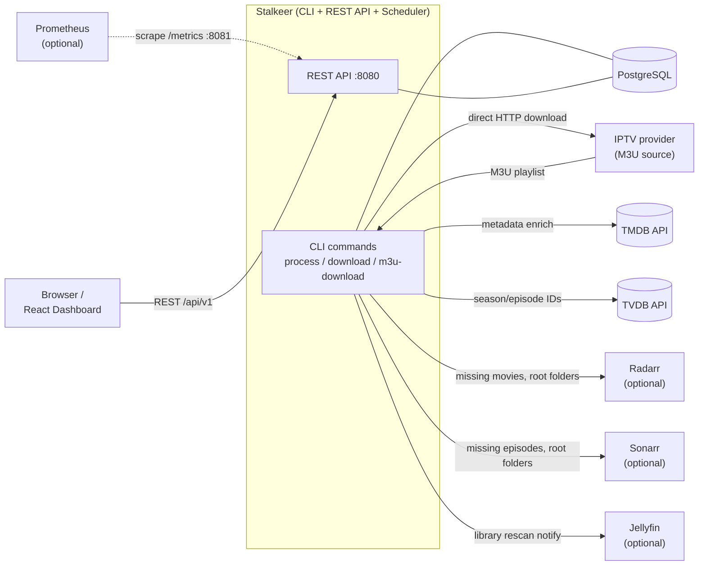
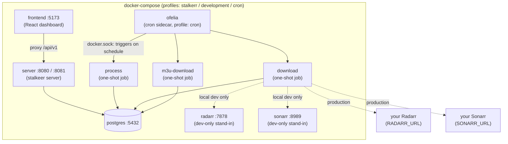
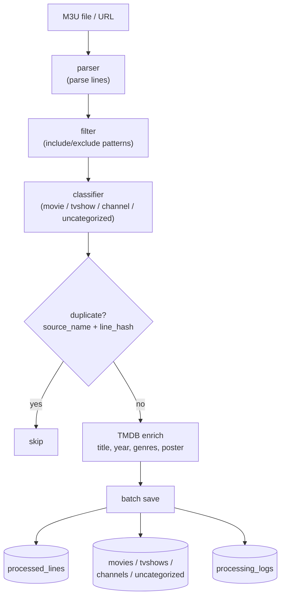
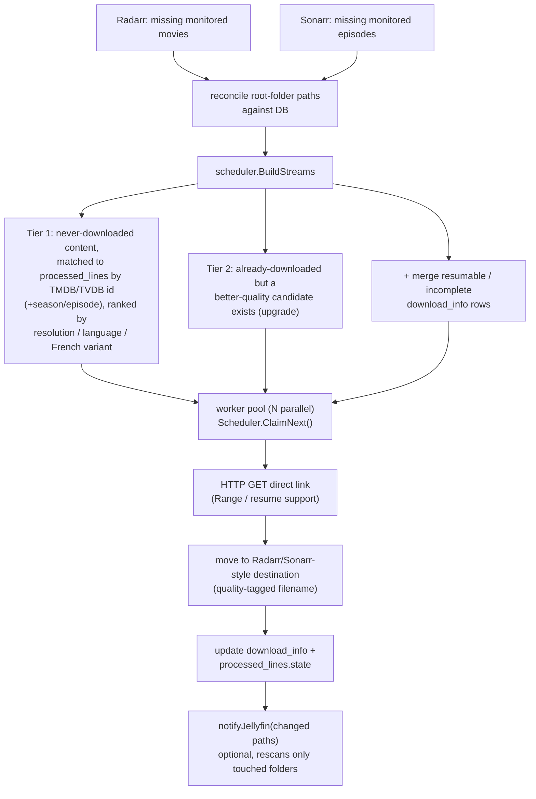

# Architecture

Stalkeer bridges an IPTV/M3U playlist to Radarr/Sonarr: it figures out what those tools are still missing and downloads it straight from the M3U source over HTTP (no torrents involved, despite the repo's home). The diagrams below give the shape of the system before you dive into setup.

## System context

## Deployment topology

## The "process" pipeline

## The "download" pipeline

For the underlying database schema and entity relationships, see [docs/DATABASE.md](docs/DATABASE.md#entity-relationships).
