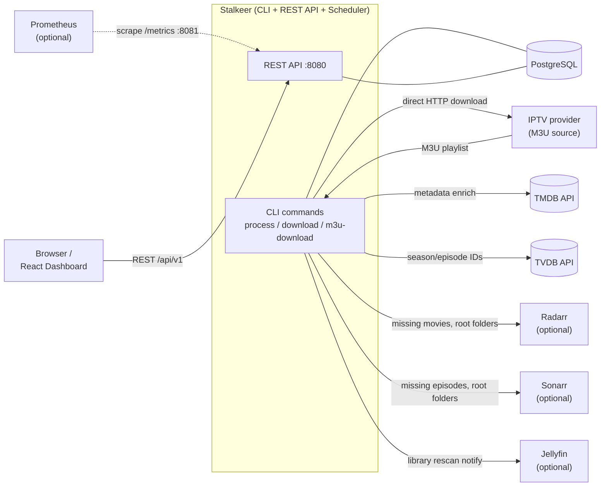
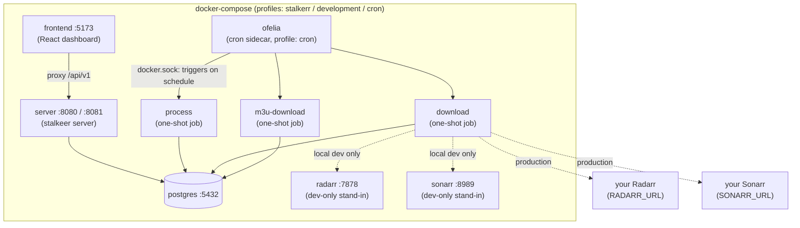
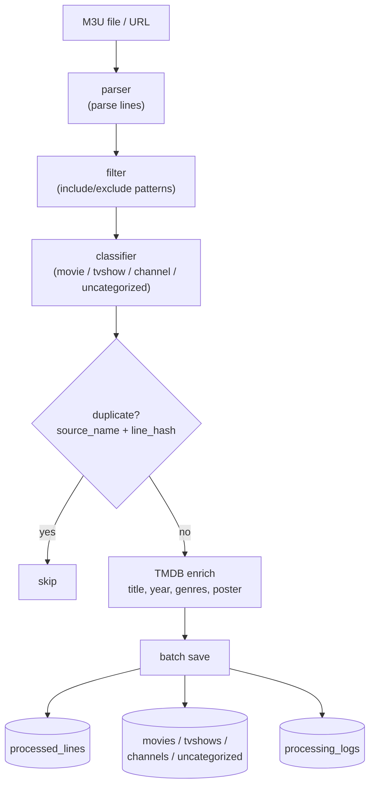
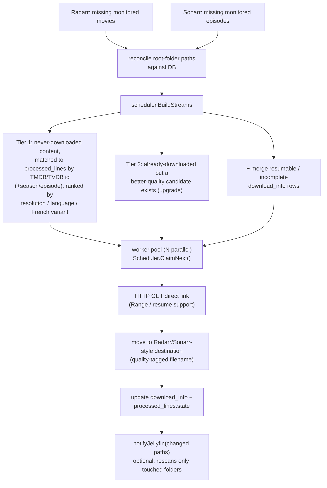

## Context

See `proposal.md` - Why. `README.md` currently jumps straight from the feature list to install/config instructions with no picture of the system: what's optional (Radarr/Sonarr/Jellyfin are all `enabled: false` by default per `config.yml.example`), what's required (PostgreSQL, TMDB), and how the two core CLI pipelines (`process`, `download`) actually move data. `docs/DATABASE.md` already has a maintained entity-relationship tree (lines 295-320) - the design below deliberately does not duplicate it.

## Goals / Non-Goals

**Goals:**
- Give a first-time reader a system-context view (every external system Stalkeer talks to, and which are optional) before they read the setup steps.
- Show the docker-compose service topology (what `server`/`process`/`download`/`m3u-download`/`ofelia`/`frontend` each do and how they relate) so `docker-compose.yml` doesn't have to be reverse-engineered.
- Show the two pipelines (`process`, `download`) at a level that matches the CLI commands, not internal function calls.
- Produce finished Mermaid source, ready to paste into `README.md` as-is.

**Non-Goals:**
- Re-documenting the database schema/ER relationships (already in `docs/DATABASE.md`) - link to it instead.
- Diagramming the Helm chart / Kubernetes CronJob topology (already covered in prose in `charts/stalkerr/README.md`).
- Restructuring any existing README section other than inserting the new one.

## Decisions

**Mermaid, not ASCII.** Confirmed with the user: this targets GitHub rendering (real boxes/arrows) over terminal-portability. Trade-off accepted below.

**Placement:** new `## Architecture` section immediately after `## Features` and before `## Quick Start` - a reader sees the shape of the system before being handed install steps.

**Four diagrams, one concern each**, rather than one combined diagram (a single graph mixing ~9 external systems with two internal pipelines becomes unreadable):

1. System context
2. Deployment topology (docker-compose)
3. `process` pipeline
4. `download` pipeline

**ER diagram excluded**, replaced with a link to `docs/DATABASE.md#entity-relationships`, to avoid a second hand-maintained copy drifting out of sync with the first.

**Alternatives considered:**
- Single "big picture" diagram - rejected, unreadable at this node count.
- Committed PNG/SVG images instead of Mermaid source - rejected, not diffable/greppable in a text review, and Mermaid renders natively on GitHub without an export step.

### Diagram 1 - System context

### Diagram 2 - Deployment topology (docker-compose)

### Diagram 3 - `process` pipeline

### Diagram 4 - `download` pipeline

## Risks / Trade-offs

- [Mermaid doesn't render in plain-text viewers - terminal `cat`, some git GUIs, non-Mermaid Markdown renderers] -> Mitigation: node/edge labels are plain English, so the raw fenced code block still reads as a structured outline even unrendered; GitHub, GitLab, and VS Code's built-in preview all render Mermaid natively.
- [Diagrams drift from code as the pipeline evolves] -> Mitigation: each diagram is deliberately pinned at command/service granularity (not function-level), so ordinary feature work shouldn't invalidate them; only a new external integration, a new docker-compose service, or a new pipeline stage should require an update.

## Migration Plan

Single additive edit to `README.md` - insert the new section, no other content changes. Rollback is a plain revert of that one commit.
